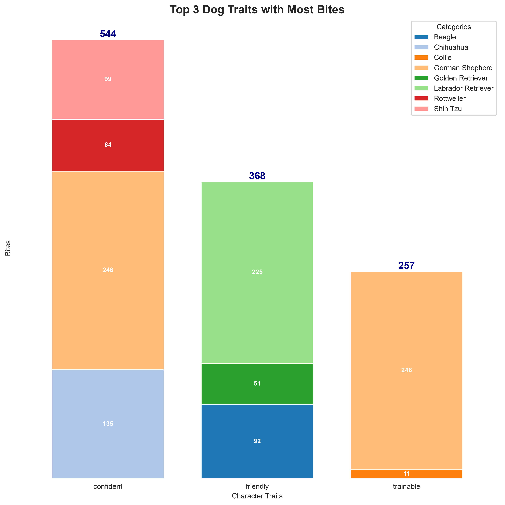
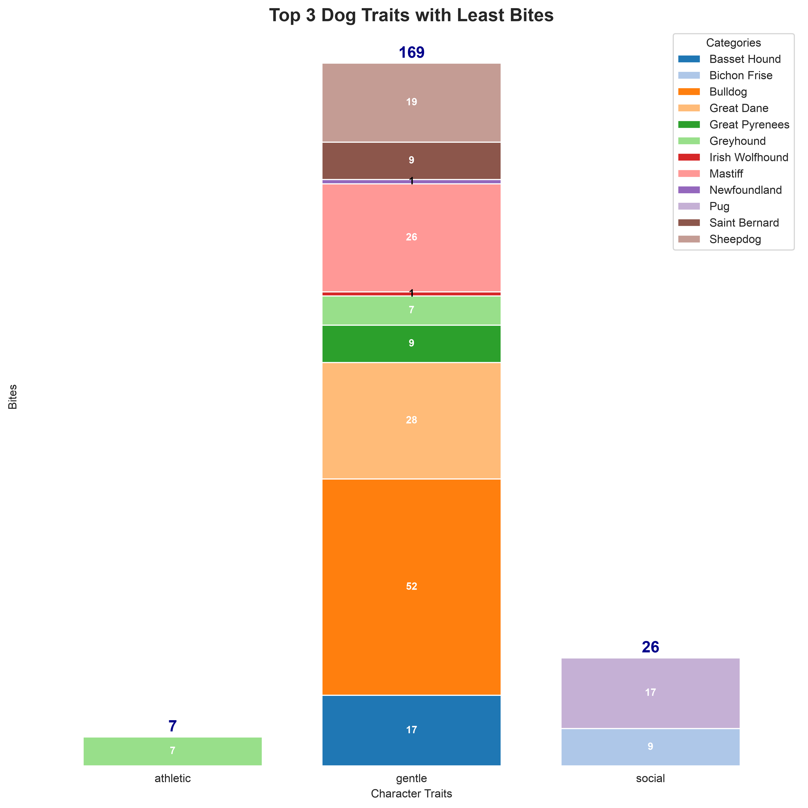

# Aggressive Dogs Don't Bite (Or Do They?)

If you rank dog traits by reported bites, the "dangerous" breeds are nowhere near the top. The biters are the *confident*, *friendly*, *trainable* family dogs. This exploratory analysis walks into that trap on purpose — and then explains the way out.

**Full analysis:** [`dog-traits-vs-bites.ipynb`](dog-traits-vs-bites.ipynb)

## What We Did

Using reported bite cases from Louisville, KY joined with breed character profiles, we normalized ~150 messy breed name variants, linked every trait to the breeds that carry it, and ranked traits by the average number of reported bites.

## The Headline Result

### Traits with the most reported bites

### Traits with the least reported bites

Confident, friendly, trainable dogs "bite the most." Gentle and social dogs "bite the least." The scary breeds are nowhere to be seen.

## The Catch: Base Rates

That reading is wrong — instructively wrong:

* **These are counts, not rates.** Labradors and German Shepherds are among the most popular dogs in America; more dogs means more encounters and more reports, regardless of temperament.
* **The denominator is missing.** Judging a breed's *propensity* to bite needs bites per registered dog, which this dataset cannot provide.
* **Selection effects cut the other way.** Breeds with an aggressive reputation are rarer, more regulated, and handled more cautiously — all of which suppresses their raw counts.

## What the Data Does Support

* Most reported bites come from popular, family-friendly breeds — a friendly reputation is no reason to skip supervision, especially around children.
* Raw bite counts are dominated by exposure, not temperament. Any "dangerous breeds" ranking built on them deserves suspicion — in either direction.

So: aggressive dogs don't bite... exactly as much as naive counting suggests. The full notebook shows every step, including the trap.
